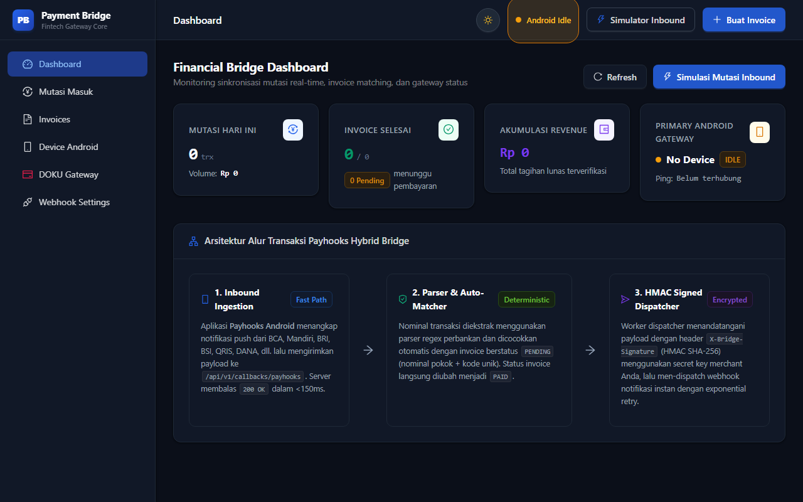

# 🌉 Payment Bridge — Hybrid Fintech Gateway & Inbound Notification Processor

[](https://payment-bridge-ecru.vercel.app)
[](https://reactjs.org/)
[](https://ant.design/)
[](https://nodejs.org/)
[](LICENSE)

> **Payment Bridge** adalah sistem hybrid gateway fintech modern yang menghubungkan penangkapan notifikasi mutasi perbankan/e-wallet real-time via **Payhooks Android** dan **DOKU Payment Gateway (Jokul API V2)**, melakukan parsing regex multi-bank cerdas, pencocokan invoice otomatis (*unique code anti-collision*), serta men-dispatch webhook terenkripsi HMAC SHA-256 ke server merchant.

---

## 🌐 Live Demo & Production
* **Web Dashboard**: [https://payment-bridge-ecru.vercel.app](https://payment-bridge-ecru.vercel.app)
* **API Healthcheck**: [https://payment-bridge-ecru.vercel.app/health](https://payment-bridge-ecru.vercel.app/health)

---

## 📸 Preview Antarmuka

| Light Mode | Dark Mode (Mode Malam) |
| :---: | :---: |
|  |  |

---

## ✨ Fitur Unggulan

- ⚡ **Ultra-Fast Inbound Ingestion (<150ms)**: Merespons webhook inbound dari Android Payhooks & DOKU secara non-blocking dan memproses pencocokan di background queue.
- 📱 **Multi-Bank & E-Wallet Regex Parser**: Mendukung parsing otomatis mutasi dari BCA, Mandiri (Livin'), BRI (BRImo), BNI (wondr), BSI (BYOND), SeaBank, Bank Jago, Jenius BTPN, DANA, OVO, GoPay, ShopeePay, LinkAja, dan QRIS.
- 💳 **DOKU Payment Gateway Support**: Dukungan penuh Virtual Account, QRIS Dinamis, E-Wallet, dan Gerai Retail dengan validasi tanda tangan (*digest signature*).
- 🎯 **Deterministic Invoice Auto-Matcher**: Algoritma pencocokan kode unik 3 digit anti-tabrakan untuk transfer bank manual.
- 🔐 **HMAC SHA-256 Signed Outbound Dispatcher**: Mengirim notifikasi lunas ke sistem merchant Anda dengan header keamanan `X-Bridge-Signature` dan sistem *exponential backoff retry*.
- 🌙 **Tema Gelap & Terang Modern (Dark Mode)**: Antarmuka berbasis Ant Design 5 dengan dukungan dynamic theme switching dan penyimpanan preferensi lokal.
- 🧪 **Simulator Inbound & Manual Matcher**: Dilengkapi panel simulasi mutasi untuk pengujian integrasi tanpa harus melakukan transfer riil.

---

## 🏗️ Arsitektur Sistem

```
┌────────────────────────────────┐         ┌────────────────────────────────┐
│  📱 Smartphone Android         │         │  💳 DOKU Payment Gateway       │
│     (Payhooks Notif Listener)  │         │     (Jokul Notification)       │
└───────────────┬────────────────┘         └───────────────┬────────────────┘
                │ POST /api/v1/callbacks/payhooks          │ POST /api/v1/callbacks/doku
                │ (Header: X-Payhooks-Key)                 │ (Header: Client-Id, Signature)
                ▼                                          ▼
┌───────────────────────────────────────────────────────────────────────────┐
│                           🌉 PAYMENT BRIDGE SERVER                        │
│                                                                           │
│  [1. Fast-Path Ingestion] ──► 200 OK (<50ms)                              │
│  [2. Parser Engine]       ──► Regex Extraction (Amount, Sender, App)      │
│  [3. Invoice Matcher]     ──► Match Total Amount (Base + Unique Code)     │
│  [4. Status Mutation]     ──► UPDATE Invoice SET status = 'PAID'          │
│  [5. HMAC Signer]         ──► Generate HMAC SHA-256 Outbound Signature    │
└─────────────────────────────────────┬─────────────────────────────────────┘
                                      │
                                      │ Outbound HTTP POST Webhook
                                      │ (Header: X-Bridge-Signature)
                                      ▼
                   ┌──────────────────────────────────────┐
                   │  🖥️  Server Merchant / Backend Anda   │
                   │     (Laravel / Node / Django / Go)   │
                   └──────────────────────────────────────┘
```

---

## 🚀 Panduan Memulai Cepat (Local Development)

### Prasyarat
- **Node.js**: versi `22.x` atau lebih tinggi
- **npm**: versi `10.x` atau lebih tinggi

### 1. Kloning Repositori
```bash
git clone https://github.com/naufalirfan/payment-bridge.git
cd payment-bridge
```

### 2. Instal Dependensi
```bash
npm install
```

### 3. Konfigurasi Lingkungan
Buat file `.env` (atau gunakan `.env.example`):
```env
PORT=3001
NODE_ENV=development
```

### 4. Jalankan Server & Client Secara Bersamaan
```bash
npm run dev
```
* **Frontend (Vite UI)**: `http://localhost:5173`
* **Backend API**: `http://localhost:3001`

---

## ☁️ Deployment ke Vercel

Aplikasi ini telah dikonfigurasi penuh untuk deploy ke Vercel sebagai Fullstack Monorepo Serverless.

```bash
# Login ke Vercel CLI
vercel login

# Deploy ke Production
vercel deploy --prod --yes
```

---

## 📚 API Reference

### 1. Inbound Webhook: Payhooks Android
* **Endpoint**: `POST /api/v1/callbacks/payhooks`
* **Headers**: `X-Payhooks-Key: <DEVICE_SECRET_KEY>`
* **Payload Contoh**:
```json
{
  "device_id": "PH-AND-01",
  "app": "com.bca",
  "title": "BCA Mobile",
  "text": "Transfer Masuk Rp 150.123 dari JOHN DOE",
  "timestamp": 1728000000
}
```

### 2. Inbound Webhook: DOKU Gateway
* **Endpoint**: `POST /api/v1/callbacks/doku`
* **Headers**: `Client-Id`, `Request-Id`, `Request-Timestamp`, `Signature`

### 3. Outbound Webhook ke Merchant
* **Headers**:
  * `Content-Type: application/json`
  * `X-Bridge-Signature: <HMAC_SHA256_HEX_SIGNATURE>`
* **Payload**:
```json
{
  "event_id": "9a12c4e0-53bc-4b68-98e1-512c98d781b2",
  "event": "invoice.paid",
  "timestamp": 1728000000,
  "data": {
    "invoice_id": "INV-202610-1002",
    "customer_name": "Naufal Pratama",
    "amount": 250000,
    "unique_code": 123,
    "total_amount": 250123,
    "paid_amount": 250123,
    "source_app": "com.bca",
    "payment_method": "MANUAL_TRANSFER",
    "paid_at": "2026-10-06T04:30:00.000Z",
    "matched_type": "automatic"
  }
}
```

---

## 🔒 Verifikasi HMAC Signature di Backend Merchant (Contoh PHP & Node.js)

### Contoh Node.js / Express:
```javascript
import crypto from 'crypto';

function verifyBridgeWebhook(req, secretKey) {
  const signature = req.headers['x-bridge-signature'];
  const expected = crypto
    .createHmac('sha256', secretKey)
    .update(JSON.stringify(req.body))
    .digest('hex');
  return signature === expected;
}
```

### Contoh PHP:
```php
$signature = $_SERVER['HTTP_X_BRIDGE_SIGNATURE'] ?? '';
$payload = file_get_contents('php://input');
$expected = hash_hmac('sha256', $payload, $secretKey);

if (!hash_equals($expected, $signature)) {
    http_response_code(401);
    exit('Invalid Signature');
}
```

---

## 📄 Lisensi
Didistribusikan di bawah Lisensi MIT. Lihat file `LICENSE` untuk informasi lebih lanjut.
